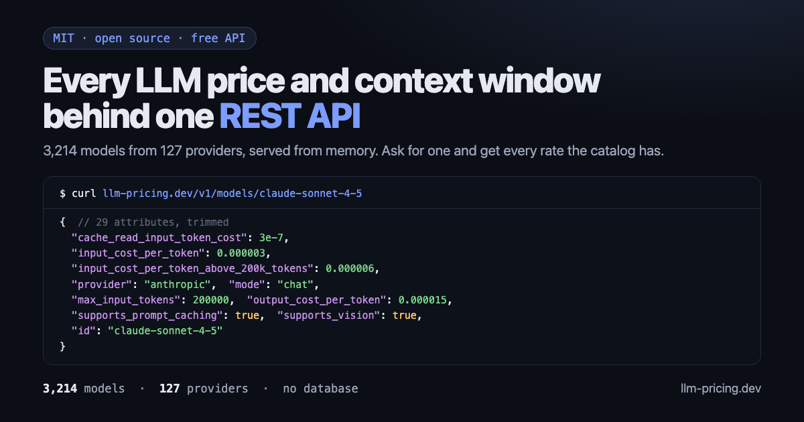

<p align="center">
  <a href="https://llm-specs.axium-lab.com">
    
  </a>
</p>

# llm-specs-api

[](https://github.com/axium-lab/llm-specs-api/actions/workflows/ci.yml)
[](https://github.com/axium-lab/llm-specs-api/releases)
[](https://github.com/axium-lab/llm-specs-api/pkgs/container/llm-specs-api)
[](LICENSE)

**Every LLM's price, context window and capabilities behind one REST API — and a cost estimator that shows its work.**

Picking a model means checking four things at once: what it costs, how much context it takes, what it can do,
and whether it is about to be deprecated. That lives in a 1.7 MB JSON file you have to parse yourself. This
service reads it once at boot and serves **3,214 models from 127 providers** out of memory, with no database —
filtered, sorted, compared — and prices a single call down to the exact rate key it used.

```bash
curl https://api-llm-specs.axium-lab.com/v1/models/claude-sonnet-4-5
```

Ask for a model and you get everything the catalog knows about it — every rate, including the ones that only
apply past a threshold or to a cache write, plus the context window and the capability flags:

```jsonc
{                                    // 29 attributes in total, trimmed here
  "deprecation_date": "2026-09-29",
  "cache_creation_input_token_cost": 0.00000375,
  "cache_creation_input_token_cost_above_1hr": 0.000006,
  "cache_read_input_token_cost": 3e-7,
  "input_cost_per_token": 0.000003,
  "input_cost_per_token_above_200k_tokens": 0.000006,
  "output_cost_per_token_above_200k_tokens": 0.0000225,
  "provider": "anthropic",
  "max_input_tokens": 200000,
  "max_output_tokens": 64000,
  "mode": "chat",
  "output_cost_per_token": 0.000015,
  "supports_prompt_caching": true,
  "supports_vision": true,
  "prompt_cache_min_tokens": 1024,
  "id": "claude-sonnet-4-5"
}
```

Or ask a question of the whole catalog — a provider, a mode, a price ceiling, a context window — and project
just the fields you care about:

```bash
curl 'https://api-llm-specs.axium-lab.com/v1/models?provider=anthropic&mode=chat&sort=input_cost_per_token:desc&fields=id,input_cost_per_token,output_cost_per_token,max_input_tokens&limit=3'
```

```json
{
  "total": 26,
  "limit": 3,
  "offset": 0,
  "data": [
    { "id": "claude-3-opus-20240229", "input_cost_per_token": 0.000015, "output_cost_per_token": 0.000075, "max_input_tokens": 200000 },
    { "id": "claude-4-opus-20250514", "input_cost_per_token": 0.000015, "output_cost_per_token": 0.000075, "max_input_tokens": 200000 },
    { "id": "claude-opus-4-1",        "input_cost_per_token": 0.000015, "output_cost_per_token": 0.000075, "max_input_tokens": 200000 }
  ]
}
```

`total` is the size of the filtered set before the page is cut, and 126 more providers' worth of models are one
`provider=` away. [Every filter, sort and projection →](https://llm-specs.axium-lab.com/api-models.html)

### And what a call actually costs

Rates are one thing; knowing which of those four Anthropic cache keys applies to *your* request is another.
That is what `POST /v1/estimate` is for — and it answers with a receipt, not a number. Every line carries
`rate_key`, the literal key it was billed with:

```
input.text         190000 x 0.000006   = 1.14    [input_cost_per_token_above_200k_tokens]
output.text          4000 x 0.0000225  = 0.09    [output_cost_per_token_above_200k_tokens]
cache_read.text     20000 x 6e-7       = 0.012   [cache_read_input_token_cost_above_200k_tokens]
cache_write.1h       8000 x 0.000012   = 0.096   [cache_creation_input_token_cost_above_1hr_above_200k_tokens]
                                        ------
                                         1.338 USD
```

That prompt crossed the 200k threshold, so the **whole** request was repriced — output included — and the 1 hour
cache TTL composed with it into that quadruple key. Both are decisions the estimator makes explicitly and
reports back in `resolution`. [The estimator in full →](https://llm-specs.axium-lab.com/api-estimate.html)

> **⚠️ Hosted instance — not live yet.** `https://api-llm-specs.axium-lab.com` is the address the free
> instance will answer on; it is not deployed at the time of writing. Until then, run it locally or deploy
> your own — it is one `docker run` away, and the dataset ships inside the image.

**📖 [Full API reference at llm-specs.axium-lab.com](https://llm-specs.axium-lab.com/api.html)** — every
endpoint, parameter, response shape and error, with the numbers taken from real responses.

## Why

- **Auditable, not magic.** Every cost line names the dataset key it used (`rate_key`) and the quantity it
  multiplied. A total you cannot check against the source is a total you cannot trust.
- **Decimal arithmetic, never `number`.** The catalog ships floating point noise already serialized
  (`1.2999000000000001e-07`) and rates as small as `1.3e-10`. Everything accumulates in `Decimal`.
- **A missing rate is never billed as 0.** 258 models legitimately declare `output_cost_per_token: 0`, so
  "free" and "unknown" have to stay distinguishable: unknown usage goes to `unpriced[]` and never inflates or
  deflates the total silently.
- **It boots without network.** The dataset is versioned in the repo and baked into the image. At boot the
  instance revalidates it upstream with `If-None-Match`; on a `304` it transfers **0 bytes**, and if upstream is
  down it serves the local copy and says so in `/health`.
- **Errors you can branch on.** Every failure is RFC 9457 `application/problem+json` with a stable `type` slug —
  `model-not-found`, `ambiguous-model`, `model-not-priced`, `limits-exceeded`, `invalid-query`.

## Quick start

Requires [Bun](https://bun.sh).

```bash
git clone https://github.com/axium-lab/llm-specs-api.git
cd llm-specs-api
bun install
bun start          # http://localhost:8080
```

Or straight from the published image — nothing to build, and the dataset is already inside:

```bash
docker run --rm -p 8080:8080 ghcr.io/axium-lab/llm-specs-api:latest
```

To build it yourself instead:

```bash
docker build -t llm-specs-api .
docker run --rm -p 8080:8080 llm-specs-api
```

Then ask it something:

```bash
# The cheapest chat models with a 1M context window
curl 'localhost:8080/v1/models?mode=chat&min_input_tokens=1000000&sort=input_cost_per_token:asc&fields=id,provider,input_cost_per_token&limit=5'

# Ids containing / and : need no escaping — the lookup route takes them literally
curl 'localhost:8080/v1/models/bedrock/us.anthropic.claude-3-5-haiku-20241022-v1:0'
```

## Endpoints

| Method | Path | Description |
|---|---|---|
| `GET` | [`/health`](https://llm-specs.axium-lab.com/api.html#health) | Liveness and readiness, dataset origin and `startup_error`. |
| `GET` | [`/v1/models`](https://llm-specs.axium-lab.com/api-models.html#list) | Listing with filters, sorting, projection and pagination. |
| `GET` | [`/v1/models/*`](https://llm-specs.axium-lab.com/api-models.html#lookup) | Lookup by id — accepts ids containing `/`, `:` and `*`. |
| `GET` | [`/v1/models/by-id?id=`](https://llm-specs.axium-lab.com/api-models.html#by-id) | Lookup by query param, for the one id a path cannot carry. |
| `GET` | [`/v1/compare?ids=a,b,c`](https://llm-specs.axium-lab.com/api-models.html#compare) | Side-by-side comparison of several models. |
| `GET` | [`/v1/providers`](https://llm-specs.axium-lab.com/api.html#providers) | The 127 providers with their model counts. |
| `GET` | [`/v1/modes`](https://llm-specs.axium-lab.com/api.html#modes) | The 16 modes with their model counts. |
| `GET` | [`/v1/attributes`](https://llm-specs.axium-lab.com/api.html#attributes) | The 153 attributes, flagging the 86 pricing ones. |
| `GET` | [`/v1/meta`](https://llm-specs.axium-lab.com/api.html#meta) | Counts, dataset origin, ETag and sha256. |
| `POST` | [`/v1/estimate`](https://llm-specs.axium-lab.com/api-estimate.html) | Cost of a single call, with a full breakdown. |

Filters for `/v1/models`: `provider`, `mode`, `q`, any of the 37 `supports_*` keys, `min_input_tokens`,
`max_input_cost`, `sort=field:asc|desc`, `fields`, `limit`, `offset`.
[Full parameter reference →](https://llm-specs.axium-lab.com/api-models.html)

## Configuration

Everything is optional — the service runs out of the box.

| Environment variable | Default | Description |
|---|---|---|
| `PORT` | `8080` | Injected by Cloud Run. |
| `DATASET_PATH` | `data/model_prices_and_context_window.json` | The source of truth. The sidecar path is derived from it. |
| `UPSTREAM_URL` | LiteLLM's `litellm_internal_staging` branch | Revalidation target. See [Upstream risk](https://llm-specs.axium-lab.com/dataset.html#upstream). |
| `FETCH_TIMEOUT_MS` | `30000` | A timeout is not fatal: the local copy is served. |
| `DEFAULT_LIMIT` | `50` | Default page size of `/v1/models`. |
| `MAX_LIMIT` | `500` | Ceiling for `limit`; a larger value is clamped, not rejected. |

Positive integers only — a malformed value fails the boot instead of being silently ignored.

## Deploy with Docker Compose

Every [release](https://github.com/axium-lab/llm-specs-api/releases) ships a `docker-compose.yml` with the
image pinned to that exact version:

```bash
curl -LO https://github.com/axium-lab/llm-specs-api/releases/latest/download/docker-compose.yml
docker compose up -d
curl localhost:8080/health
```

Images are published for `linux/amd64` and `linux/arm64` at
[`ghcr.io/axium-lab/llm-specs-api`](https://github.com/axium-lab/llm-specs-api/pkgs/container/llm-specs-api),
tagged `X.Y.Z`, `X.Y` and `latest`. A pre-release is never tagged `latest`.

The compose file declares a **named volume** over `/app/data`, and it matters: the dataset travels inside the
image and the service rewrites it when upstream has something newer, so without the volume every restart
throws that update away and starts again from the copy baked in at build time. It has to be a *named* volume —
Docker seeds one from the image on first use, whereas an empty bind mount would hide the dataset and leave the
service with nothing to serve.

## Deploying to Cloud Run

```bash
gcloud run deploy llm-specs-api --source . --region europe-west1 \
  --min-instances 1 --cpu-boost --allow-unauthenticated
```

`--min-instances 1` is a latency choice, not a correctness one: a cold start revalidates the baked-in copy with
`If-None-Match` and transfers nothing on a `304`, and a boot while GitHub is down serves the local dataset
instead of failing. Keep it if you care about cold-start latency, drop it if you care about idle cost.

> **If you mount a Cloud Storage bucket**, do not mount it over `data/`: GCS FUSE hides whatever sits below the
> mount point, just like any Linux `mount`, and you would lose the file baked into the image. Use a separate
> path (`/mnt/dataset`) and point `DATASET_PATH` at it.

## Known limitations

The estimator is honest about what it does not price. These are accepted inputs or dataset features that
currently produce **no cost line**, and they are worth knowing before you trust a total:

| Limitation | Effect |
|---|---|
| `usage.web_search` and `usage.search_results` | Accepted and validated, but never billed. `search_context_cost_per_query` (282 models) is declared in the catalog and never read. They do not even show up in `unpriced[]`. |
| `options.tier_policy: "marginal"` | Does not compute per-band pricing. It falls through to the base rate, so the result is the same as a request that never crossed a threshold. |
| `tiered_pricing` | Not read. The 21 models that price *only* through it answer `200` with a total of `0` and all usage in `unpriced[]`. |
| Databricks DBU rates | The `input_dbu_cost_per_token` / `output_dbu_cost_per_token` keys (47 models) are described in the catalog but no usage field maps to them, so a DBU total is never produced. |
| Malformed JSON, or a body over 256 kB | Answers `500 internal-error` instead of `400` / `413`. |

## Data source

The catalog is LiteLLM's [`model_prices_and_context_window.json`](https://github.com/BerriAI/litellm), MIT
licensed, vendored into `data/` and redistributed **normalized**: `src/data/parse.ts` renames
`litellm_provider` to `provider` on the way in, and that is the only place where upstream's shape is adjusted.
The prices are the ones LiteLLM publishes — this project does not source, correct or negotiate them, and
[flags the implausible ones](https://llm-specs.axium-lab.com/dataset.html#suspicious) rather than fixing them.
[How the dataset is loaded →](https://llm-specs.axium-lab.com/dataset.html)

## Development

```bash
bun run dev        # start with file watching
bun test           # HTTP surface, pricing engine, dataset resolution, catalog completeness
bun run typecheck  # tsc --noEmit
```

Stack: [Bun](https://bun.sh) + TypeScript + [Express 5](https://expressjs.com). No build step, no database, no
state: `src/data/` owns the dataset, `src/pricing/` owns the cost engine, `src/routes/` owns the HTTP surface.

## Contributing

Issues and PRs are welcome — see [CONTRIBUTING.md](CONTRIBUTING.md). The one hard rule: every endpoint and every
pricing rule keeps a test that proves it.

## License

[MIT](LICENSE)
